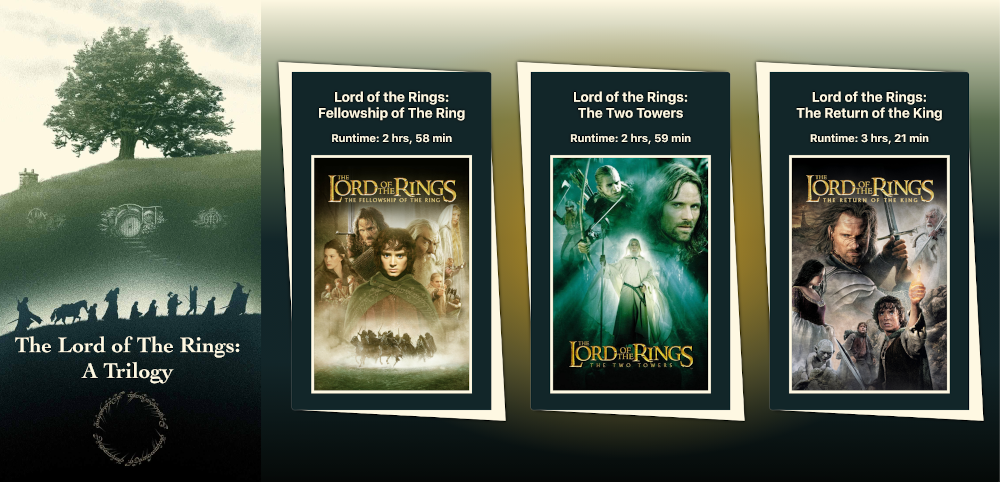

# React Lord of the Rings 


## Overview
Let's build something small to reinforce what you've learned so far. We're going to practice creating components and passing information into them through props. We'll be building a simple website that displays titles, movie posters, and runtime for the original Lord of the Rings Trilogy.

## Objectives
- Pass data through React props into child components 
- Create a reusable component to display data from props

## What You'll Be Building

You'll be building a website in this lab with a header and 3 movies. Here is an example site:



## Getting Started
- `Fork` and `clone` this repository and `cd` into the new directory.
- Create a new React app called `lord-of-the-rings`.
- You'll be working in the `src` directory of this new React app.


## Instructions
### Setup
- First we'll need to clear out the initial `App.js` boilerplate component inside `src` and replace it with something more suitable.
- We'll keep the `<header>` for now since we'll be adding a title to it later, and add a `<main>` below it as a wrapper for our movie content.
- Your `App.js` should look like this when you've finished:
```jsx
import React from 'react';
import './App.css';

function App() {
  return (
    <div className="App">
      <header className="App-header">
        
      </header>
      <main>
        
      </main>
    </div>
  );
}

export default App;
```

___
### Create A Simple Movie Component
- Inside of the `./src` folder, create a new directory called `components`. The `components` directory is typically where you'll add components in a React project to organize your files.
- Inside of the `components` folder, create a new React Component file called `Movie.js`.
- Add some JSX to the render function so this component will be visible in
our application. 
- Let's keep the JSX simple for now, and we'll make it more
complex once we're sure it works.

Remember, our goal is to display the movie poster, title, and runtime information. 
- Let's add one `<h1>` for the movie title, one `` for the poster, and a `<p>` for the runtime.

___
### Viewing the Component

- Open `src/App.js`.

Add the `<Movie />` component just after the paragraph. Go back to the
app and see if it appears.

___
### Dealing with Errors
Uh oh. There's an error.

```
Failed to compile
./src/App.js
  Line 15:  'Movie' is not defined  react/jsx-no-undef
```

`'Movie'` is not defined? Ah.

One does not simply refer to components in React. In our `src/App.js`, we're saying "Display what's returned from the `Movie` component." However - we haven't told `src/Apps.js` where to find the `Movie` component! 

Add an import statement at the top of the `src/App.js` file.

Now you should see the page without the error message, and it should have the
JSX from the Movie component.

___
### Passing Information via Properties
We need to make the Movie component accept information so we can use it to
display different titles and runtimes. In the `src/App.js` file, add `title`, `hours`, and `minutes`
props to the `<Movie>` tag. 

We'll be able to read the value of these props from inside the component. You can name props pretty much
anything you want - but it's good practice to be descriptive!

Update the JSX in `src/Movie.js` to access and display the value of each prop we created.

Refresh the page and make sure everything works correctly.

___
### Reusing the Component
Once you've got props working for one component, then write two more!

In `src/App.js`, call the `<Movie />` component again with different values for the `title`, `hours` and `minutes`
properties. Display information for the complete trilogy! (If you don't know everything about Lord of the Rings off the top of your head, here it is).

title | hours | minutes
------|-------|--------
The Fellowship of the Ring | 2 | 58
The Two Towers | 2 | 59
The Return of the King | 3 | 21

# Solution
When you're finished, review the reflections below.

### Reflecting on Reusability
Components are great because they allow us to compartmentalize code and easily reuse parts we create. We simply set the value of props and the component defines how everything should be displayed.

In this instance, we factored out some redundancy of the
movie titles.
- All these movies start with `"Lord of the Rings:"`, so only the unique part is the prop.
- Similarly, we don't have to rewrite the format of the runtime information.

Building and reusing components becomes especially powerful the more complex components become.
- Imagine building a component for video search results inside YouTube.
  - The props list is huge:
    - ton of links
    - time information
    - preview images
    - options to add the result to a playlist
    - and all sorts of other things.

Building one component to rule all them all would save you a lot of time and headaches!


### Internet Dive Point
In case you want to nerd out, here are handy links to the IMDB page for each
movie:

* [Lord of the Rings: The Fellowship of the Ring](http://www.imdb.com/title/tt0120737/)
* [Lord of the Rings: The Two Towers](http://www.imdb.com/title/tt0167261/)
* [Lord of the Rings: The Return of the King](http://www.imdb.com/title/tt0167260/)

_edited from [global code-along](https://github.com/WDI-SEA/react_intro_global/blob/master/11-lotr-codealong.md)_
